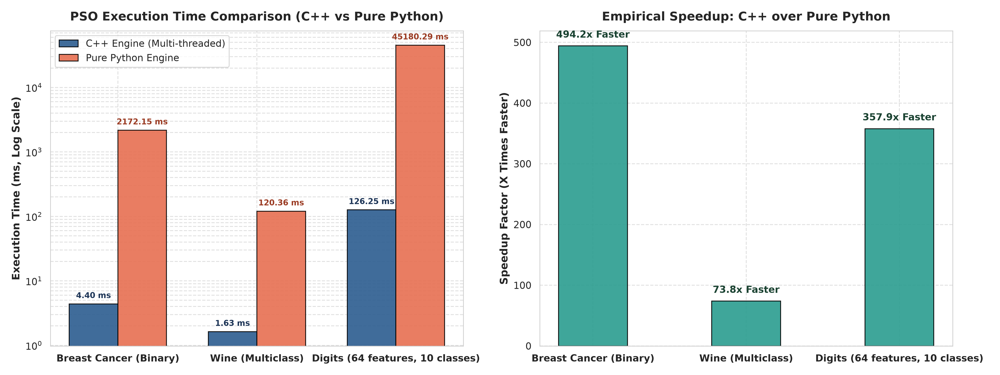
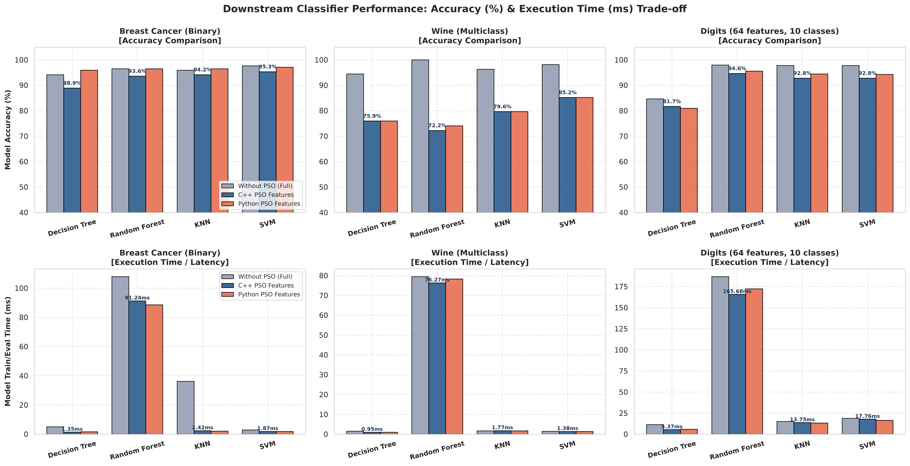
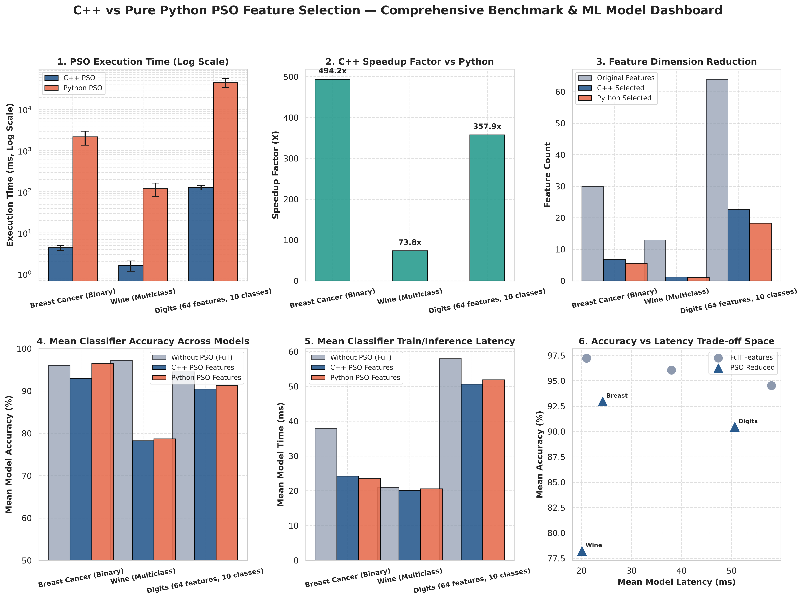

# Hybrid BPSO Feature Selection & Performance Benchmarking
**โครงงานการทดลองและวิจัยเชิงเปรียบเทียบในรายวิชา Machine Learning (Machine Learning Project)**

---

## 📌 บทนำและวัตถุประสงค์ของโครงงาน (Project Overview & Objectives)

โครงงานนี้พัฒนาขึ้นเพื่อศึกษาและเพิ่มประสิทธิภาพของกระบวนการ **Machine Learning Pipeline** ใน 2 มิติหลัก:

1. **การคัดเลือกคุณลักษณะ (Feature Selection Optimization):**
   - ประยุกต์ใช้อัลกอริทึม **Binary Particle Swarm Optimization (BPSO)** ร่วมกับเกณฑ์การวัดความคุ้มค่า **Fisher Score** เพื่อลดมิติของข้อมูล (Dimensionality Reduction) ตัดฟีเจอร์ที่ไม่จำเป็นหรือเป็นสัญญาณรบกวน (Noise) ออก
   - ศึกษา **ความคุ้มค่า (Trade-off) ระหว่างความแม่นยำ (Accuracy) และเวลาประมวลผล (Inference Latency)** ของโมเดล Machine Learning
2. **การเพิ่มประสิทธิภาพการคำนวณระดับสถาปัตยกรรม (High-Performance Computing & Language Benchmarking):**
   - พัฒนาแกนการคำนวณ BPSO ด้วยภาษา **C++ (Multi-threading via `std::thread` & SIMD Optimization)** เชื่อมต่อ Python ผ่าน **Pybind11**
   - พัฒนาแกนการคำนวณแบบเดียวกันเป๊ะๆ ด้วย **Pure Python (1:1 Mathematical & Algorithmic Equivalence)** เพื่อทดลองและจับเวลาพิสูจน์เชิงประจักษ์ (Empirical Evidence) ว่าการลด Overhead ของภาษาและการจัดการหน่วยความจำระดับต่ำช่วยเร่งความเร็วของอัลกอริทึมได้มากน้อยเพียงใด

---

## 🧠 ทฤษฎีและสูตรการคำนวณ (Mathematical Formulation)

### 1. ฟังก์ชันความเหมาะสม (Fitness Evaluation Function)
ใช้วิธี **Fisher Score** ควบคู่กับค่าปรับตามสัดส่วนฟีเจอร์ที่ถูกเลือก (Penalty Factor) เพื่อบีบให้ฝูงอนุภาคเลือกเฉพาะฟีเจอร์ที่สำคัญจริง:

- **สำหรับข้อมูล Binary Classification:**
  $$\text{Fisher Score}_j = \frac{(\mu_{0, j} - \mu_{1, j})^2}{\sigma_{0, j}^2 + \sigma_{1, j}^2}$$
  $$\text{Fitness} = \frac{1}{|S|} \sum_{j \in S} \text{Fisher Score}_j - \left(0.05 \times \frac{|S|}{D}\right)$$
  *(โดยที่ $|S|$ คือจำนวนฟีเจอร์ที่ถูกเลือก และ $D$ คือจำนวนฟีเจอร์ทั้งหมด)*

- **สำหรับข้อมูล Multiclass Classification:**
  $$\text{Fisher Score}_j = \frac{\text{Between-class Scatter}}{\text{Within-class Scatter}} = \frac{\sum_{c=1}^{C} N_c (\mu_{c, j} - \mu_{\text{global}, j})^2}{\sum_{c=1}^{C} \sum_{i \in c} (x_{i, j} - \mu_{c, j})^2}$$
  $$\text{Fitness} = \frac{1}{|S|} \sum_{j \in S} \text{Fisher Score}_j - \left(0.05 \times \frac{|S|}{D}\right)$$

### 2. การอัปเดตความเร็วและตำแหน่งของอนุภาค (Swarm Dynamics)
- **Velocity Update:**
  $$v_{i, j}^{t+1} = w \cdot v_{i, j}^t + c_1 r_1 (pbest_{i, j} - x_{i, j}^t) + c_2 r_2 (gbest_j - x_{i, j}^t)$$
  *(กำหนด $w=0.7, c_1=1.5, c_2=1.5$)*
- **Position Update (Sigmoid Transfer Function):**
  $$S(v_{i, j}^{t+1}) = \frac{1}{1 + e^{-v_{i, j}^{t+1}}}$$
  $$x_{i, j}^{t+1} = \begin{cases} 1 & \text{ถ้า } \text{rand}(0, 1) < S(v_{i, j}^{t+1}) \\ 0 & \text{กรณีอื่นๆ} \end{cases}$$

---

## 📊 รายละเอียดการอ่านและวิเคราะห์กราฟเปรียบเทียบ (Visualizations Guide)

เมื่อสั่งรันสคริปต์ `benchmark_comparison.py` ระบบจะทำการทดลองหลายรอบ (Multi-trial) ในหลากหลายขนาดชุดข้อมูล และสร้างกราฟผลการทดลองออกมาเป็น 3 ไฟล์หลัก ดังนี้:

---

### กราฟที่ 1: `benchmark_timing_comparison.png`
*(กราฟเปรียบเทียบประสิทธิภาพเวลาและความเร็วของแกนคำนวณ PSO)*



#### 1. กราฟซ้าย: Execution Time Comparison (Log Scale)
- **วัตถุประสงค์ในการเปรียบเทียบ:** เพื่อเปรียบเทียบเวลาที่ใช้ในการค้นหาและคำนวณคุณลักษณะของ PSO ระหว่าง C++ Engine และ Pure Python Engine
- **ทำไมต้องใช้ Log Scale บนแกน Y:** เนื่องจาก C++ ทำงานในระดับเสี้ยวของมิลลิวินาที (ms) ในขณะที่ Python ใช้เวลาหลายวินาทีในชุดข้อมูลขนาดใหญ่ การใช้สเกลแบบลอการิทึม (Logarithmic Scale) ช่วยให้มองเห็นและเปรียบเทียบความแตกต่างที่ห่างกันหลายร้อยเท่าได้อย่างชัดเจน
- **ความหมายของแท่งกราฟและป้ายกำกับ:**
  - 🟦 **แท่งสีน้ำเงิน (`C++ Engine`):** เวลาเฉลี่ย (ms) ที่ C++ ใช้ในการรัน PSO
  - 🟧 **แท่งสีส้ม (`Pure Python Engine`):** เวลาเฉลี่ย (ms) ที่ Python ใช้ในการรัน PSO
  - **แกน X (`Dataset Names`):** ชุดข้อมูลที่นำมาทดสอบ ได้แก่ Binary Classification และ Multiclass Classification

#### 2. กราฟขวา: Speedup Factor (X Times Faster)
- **วัตถุประสงค์ในการเปรียบเทียบ:** เพื่อแสดงอัตราส่วนความเร็วสัมพัทธ์ (Speedup Ratio = $\frac{\text{Time}_{\text{Python}}}{\text{Time}_{\text{C++}}}$)
- **ความหมายของแท่งกราฟ:**
  - 🟩 **แท่งสีเขียวมรกต (`Speedup`):** แสดงตัวเลขว่า C++ ทำงานเร็วกว่า Pure Python เป็นจำนวนกี่เท่าในแต่ละชุดข้อมูล โดยจะเห็นได้ว่ายิ่งข้อมูลมีมิติและขนาดใหญ่ขึ้น ค่า Speedup จะยิ่งเพิ่มขึ้นอย่างมีนัยสำคัญ

---

### กราฟที่ 2: `benchmark_models_comparison.png`
*(กราฟเปรียบเทียบผลลัพธ์ของโมเดล Machine Learning ในมิติ Accuracy และ Execution Time)*



#### 1. แถวบน (Top Row): Model Accuracy Comparison (%)
- **วัตถุประสงค์ในการเปรียบเทียบ:** เพื่อตรวจสอบว่าเมื่อลดจำนวนคุณลักษณะลงแล้ว โมเดลยังคงรักษาความแม่นยำในการทำนายไว้ได้หรือไม่
- **ความหมายของแท่งกราฟ:**
  - ⬜ **แท่งสีเทา (`Without PSO (Full)`):** ความแม่นยำของโมเดลเมื่อใช้ฟีเจอร์เดิมทั้งหมด 100%
  - 🟦 **แท่งสีน้ำเงิน (`C++ PSO Features`):** ความแม่นยำเมื่อเทรนด้วยฟีเจอร์ที่ C++ PSO คัดเลือก
  - 🟧 **แท่งสีส้ม (`Python PSO Features`):** ความแม่นยำเมื่อเทรนด้วยฟีเจอร์ที่ Python PSO คัดเลือก
  - **แกน X (`Model Names`):** โมเดลที่ใช้เปรียบเทียบ ได้แก่ **Decision Tree, Random Forest, KNN, และ SVM**

#### 2. แถวล่าง (Bottom Row): Model Execution / Latency Time (ms)
- **วัตถุประสงค์ในการเปรียบเทียบ:** เพื่อพิสูจน์ว่า **การลดฟีเจอร์ช่วยให้โมเดลทำงานเร็วขึ้น (Inference Latency ลดลง) มากเพียงใด** ซึ่งเป็นหัวใจสำคัญของหัวข้อ Accuracy vs Latency Trade-off ในระบบ Real-time AI
- **ความหมายของแท่งกราฟ:**
  - ⬜ **แท่งสีเทา:** เวลาที่โมเดลใช้ในการ Train/Test บนฟีเจอร์เต็ม
  - 🟦 **แท่งสีน้ำเงิน / 🟧 แท่งสีส้ม:** เวลาที่โมเดลใช้เมื่อฟีเจอร์ถูกตัดทอนลง
  - **ข้อสังเกตสำคัญ:** โมเดลอย่าง **KNN** (ซึ่งต้องคำนวณระยะทางระหว่างจุด) และ **Decision Tree** จะใช้เวลาลดลงอย่างชัดเจนเมื่อมิติของข้อมูลลดลง

---

### กราฟที่ 3: `benchmark_full_dashboard.png`
*(Dashboard สรุปภาพรวมเชิงสถิติ 6 มิติในหน้าเดียว)*



- **Panel 1 (PSO Execution Time):** เวลาประมวลผลของ PSO พร้อม Error Bar ($\pm$ ส่วนเบี่ยงเบนมาตรฐาน SD)
- **Panel 2 (Speedup Factor):** อัตราส่วนความเร็วที่ C++ ชนะ Python
- **Panel 3 (Feature Dimension Reduction):** เปรียบเทียบจำนวนคุณลักษณะตั้งต้น (Original Features) กับจำนวนคุณลักษณะที่ PSO คัดเลือก (Selected Features) แสดงให้เห็นอัตราการบีบอัดข้อมูล (Data Compression)
- **Panel 4 (Mean Classifier Accuracy):** ความแม่นยำเฉลี่ยของทุกโมเดลรวมกันในแต่ละ Dataset
- **Panel 5 (Mean Classifier Latency):** เวลาประมวลผลเฉลี่ยของทุกโมเดลรวมกัน แสดงความเร็วที่โมเดลได้รับกลับคืนมา
- **Panel 6 (Accuracy vs Latency Trade-off Space):** กราฟ Scatter Plot จุดพิกัดเปรียบเทียบระหว่าง (แกน X: ความเร็วที่ใช้) vs (แกน Y: ความแม่นยำที่ได้) เพื่อชี้ให้เห็นจุดการทำงานที่คุ้มค่าที่สุด (Optimal Operating Point)

---

## 📂 โครงสร้างของโปรเจกต์ (Project Directory Structure)

```
AI_Model_testing/
├── index.py                           # 🏁 สคริปต์หลักสำหรับรันเปรียบเทียบการทำงานทั่วไป
├── benchmark_comparison.py            # 🏁 สคริปต์หลักสำหรับรัน Benchmark เชิงสถิติและสร้างกราฟ
├── requirements.txt                   # รายการ Dependencies (Python Libraries)
├── README.md                          # เอกสารคู่มือและรายงานประกอบการทดลอง
│
├── Benchmark/                         # 📦 โมดูลระบบ Benchmark & Visualization
│   ├── __init__.py                    # Export ฟังก์ชันของระบบ Benchmark
│   ├── runner.py                      # ตัวควบคุมการทดลอง (Experiment Orchestrator)
│   ├── evaluator.py                   # ตัวทดสอบโมเดล AI (วัดทั้ง Accuracy % และ Time ms)
│   ├── visualizer.py                  # ตัวสร้างและ Render กราฟความละเอียดสูง (Matplotlib/Seaborn)
│   └── reporter.py                    # ตัวจัดการตารางสรุปผลและรายงานบน Terminal
│
└── ML/                                # 📦 โมดูล Machine Learning & Computational Intelligence
    ├── main.py                        # Class SendData สำหรับส่งต่อข้อมูลไปยังโมเดลต่างๆ
    │
    ├── Computational_Intelligence/    # ส่วนของขั้นตอนวิธี BPSO
    │   ├── Main_CI.cpp                # จุดเชื่อมต่อ C++ กับ Python (Pybind11 Binding)
    │   │
    │   └── CI_Model/PSO/
    │       ├── MainPSO.cpp / .hpp     # [C++] แกนหลักจัดการอนุภาคและรอบการคำนวณ
    │       ├── BPSO/
    │       │   └── PSOmain.py         # [C++] ฟังก์ชันรับส่งข้อมูลผ่าน Pybind11
    │       ├── Core/
    │       │   ├── Engine.cpp / .hpp  # [C++] Swarm Engine (Multi-threading)
    │       │   └── Fitness.cpp / .hpp # [C++] ฟังก์ชันคำนวณ Fisher Score
    │       │
    │       └── Python_PSO/            # [Python] โครงสร้างแยกโมดูลเหมือน C++ 1:1
    │           ├── MainPSO.py         # [Python] จัดการอนุภาคและรอบการคำนวณ
    │           ├── BPSO/
    │           │   └── PSOmain.py     # [Python] ฟังก์ชันรับส่งข้อมูล
    │           └── Core/
    │               ├── Engine.py      # [Python] Swarm Engine
    │               └── Fitness.py     # [Python] ฟังก์ชันคำนวณ Fisher Score
    │
    ├── model/                         # โมเดล Machine Learning
    │   ├── DecisionTree.py            # Decision Tree Classifier
    │   ├── Random_Forest.py           # Random Forest Classifier
    │   ├── KNN.py                     # K-Nearest Neighbors Classifier
    │   ├── SVM.py                     # Support Vector Machine (RBF Kernel)
    │   ├── Train_Test_Split.py        # การแบ่งชุดข้อมูล Train/Test
    │   └── prepare_data_universal.py  # การเตรียมและจัดการชุดข้อมูล
    │
    └── SetUp/                         # สคริปต์คอมไพล์ C++
        └── setup.py                   # สคริปต์สร้างไฟล์ .pyd ผ่าน setuptools & pybind11
```

---

## 🛠️ ขั้นตอนการติดตั้งและการใช้งาน (Installation & Setup)

### 1. ความต้องการของระบบ (Prerequisites)
- **Python:** เวอร์ชัน 3.11 ขึ้นไป
- **C++ Compiler:** MSVC (Visual Studio 2022 / C++ Build Tools บน Windows) หรือ GCC/Clang บน Linux

### 2. ติดตั้ง Python Libraries
```bash
pip install -r requirements.txt
```

### 3. คอมไพล์โมดูล C++ ให้พร้อมใช้งานกับ Python
สั่งคอมไพล์ไฟล์ C++ ให้กลายเป็นนามสกุล `.pyd` (Windows) หรือ `.so` (Linux):
```bash
cd ML/SetUp
python setup.py build_ext --inplace
cd ../..
```

### 4. สั่งรันการทำงาน

- **รันการทดสอบเบื้องต้น (ดูฟีเจอร์และผลลัพธ์ C++ vs Python):**
  ```bash
  python index.py
  ```

- **รันระบบ Benchmark เชิงสถิติเต็มรูปแบบพร้อมสร้างกราฟรายงาน:**
  ```bash
  python benchmark_comparison.py
  ```
  *(เมื่อรันเสร็จ กราฟ `benchmark_timing_comparison.png`, `benchmark_models_comparison.png`, และ `benchmark_full_dashboard.png` จะถูกอัปเดตให้อัตโนมัติในโฟลเดอร์ทันที)*